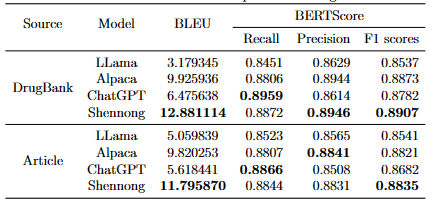

# **Shennong: A Pharmaceutical Chat Model via Unifying Heterogeneous Domain Knowledge**


## Directory

- [What do we do?](https://github.com/ShuoSun-CN/Shennong#what-do-we-do)


- [performance and case](https://github.com/ShuoSun-CN/Shennong#Performance-and-case)

[//]: # (  - **Checkpoint-4000**&#40;Facico/Chinese-Vicuna-lora-7b-0.75epoch-belle-and-guanaco&#41;)

[//]: # ()
[//]: # (  - **Checkpoint-8000**&#40;Facico/Chinese-Vicuna-lora-7b-1.5epoch-belle-and-guanaco&#41;)

[//]: # ()
[//]: # (  - **Checkpoint-final**&#40;Facico/Chinese-Vicuna-lora-7b-3epoch-belle-and-guanaco&#41; and it is used for multiple rounds of dialogue)
- [How to use](https://github.com/ShuoSun-CN/Shennong#how-to-use)
  - Installing、Multi-gpu training、Single-gpu training、Inference and use gradio to generate a web page(Streaming mode+beam search)、 multi-round interaction and use gradio to generate a web page(Streaming mode+beam search)、Streaming mode base on alpaca-lora-serve
- [try on colab](https://github.com/ShuoSun-CN/Shennong#try-on-colab)
## Overview

-  LLaMA paper: https://arxiv.org/abs/2302.13971v1
-  Self-Instruct paper: https://arxiv.org/abs/2212.10560
-  data generation: https://github.com/LianjiaTech/BELLE and https://guanaco-model.github.io/
-  the first work: https://github.com/tatsu-lab/stanford_alpaca

We currently select the combination of BELLE and Guanaco data as our main training dataset. 
We will train on multi-turn instruction data.

## What do we do?

Based on [Chinese-Vicuna](https://github.com/Facico/Chinese-Vicuna), we use different kinds of data to finetune this model to get Shennong.
And Shennong is good at answering the question about pharmacology. It's magic that Shennong can not only answer the frontier question about 
pharmacology but also help predict the route of synthesising a molecule or modify molecule that it can have better character.

## Performance and Case

### Performance
This figure show the performance of Shennong and other large language models on data of Drugbank and article about
 pharmacology.





### Case
These figures show cases that Shennong answer the question of molecule synthesising and molecule modifying.


figure

figure


## How to use

**Installation**

```
git clone https://github.com/ShuoSun-CN/Shennong#
pip install -r requirements.txt
```

Local python environment is 3.8, torch is 1.13.1, CUDA is 12

NOTE: python3.11 has a known `torchrun` bug, details [here](https://github.com/facebookresearch/llama/issues/86)

**Multi-round interaction**

As we use the basic command prompt when training, so the ability of small talk conversation is still relatively poor, the follow-up will increase this part of the training.

```bash
python interaction.py --lora_path shennong-lora
```

- A simple interactive interface constructed using gradio, which allows you to set the max_memory according to your machine (it will intercept the max_memory part later in the history conversation)

- The prompt used in this script is not quite the same as the one used in generate.sh. The prompt in this script is in the form of a dialogue, as follows

  - ```
    The following is a conversation between an AI pharmacologist called Shennong and a human user called User.
    ```


**Shennong-web Installation**

Before we install Shennong-web service ,we need setup our development environment firstly.

***Development Environment Setup***

****Node****

`node` need `^16 || ^18` vision（`node >= 14`
need install [fetch polyfill](https://github.com/developit/unfetch#usage-as-a-polyfill)
），use [nvm](https://github.com/nvm-sh/nvm) can manage multiple local `node` visions

```shell
node -v
```

****PNPM****

If you haven't installed  `pnpm`, you should install it by this command.

```shell
npm install pnpm -g
```


After that, we can install Shennong on our own server by these commands.

***Back-end Service Installation***
```bash
python ./shennong-web/service/main.py --lora_path shennong_lora
```

- This command can switch on Shennong back-end service on specific port.
- You can modify the port, but you also modify the port of front-end service so that these two services can contact normally.

***Front-end Service Installation***
```bash
pnpm bootstrap
pnpm dev
```

- This command can switch on Shennong front-end service on specific port.
- Please run these command in root directory of this project.


**Finetune Based on Shennong**

If you want to finetune Shennong with your own data, this command will help you.
```bash
python finetune.py --lora_path shennong-lora --data_path yourdata.json --output_path youroutpath
```

- `yourdata.json` is your own data.

- `youroutpath`  is the directory that you want to save the model parameters.

The data format is relatively simple, basically as follows, with simple examples such as:
```
{
'instruction': 
'input': 
'output'
}
```

## Try on colab
If you just want to have try or you don't have enough resource to build Shennong, you can click this link.
This link will help you build Shennong on Colab which cost nothing.

| colab link                                                   | Descriptions                       |
| ------------------------------------------------------------ |------------------------------------|
| [](https://colab.research.google.com/drive/1ftDqBVTRkADHPYn3ZFRfWXRbG83iGv4k?usp=sharing) | Multiple intercation with Shennong |


